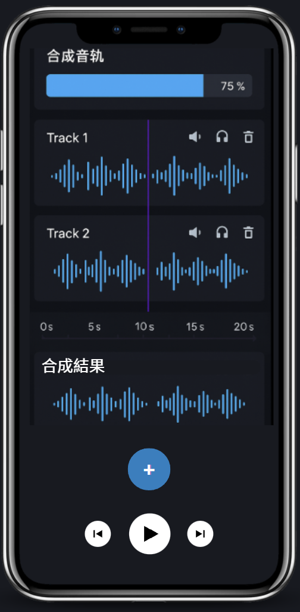

# Clipnote Audio




Clipnote Audio is a Flutter-based multi-track audio editor that uses native FFmpeg decoding and a custom PCM player via FFI. It
supports real-time mixing, spectrum analysis, and waveform editing on multiple tracks.

Clipnote Audio 是一款基於 Flutter 的多軌音訊編輯器，透過 FFI 呼叫原生 FFmpeg 解碼與自製 PCM 播放器，支援即時混音、頻譜分析與多軌
編輯。

## Features / 功能

- Import MP3/M4A/WAV/AAC files with the built-in file picker / 透過檔案選取器匯入 MP3、M4A、WAV、AAC 音訊
- Drag tracks on the timeline, long‑press to trim segments / 在時間軸上拖曳音軌並長按剪裁區段
- Adjustable per‑segment fade in/out / 每段音訊可調整淡入淡出
- Unified play/pause preview and real‑time spectrum analysis (200 ms FFT) / 統一播放/暫停預覽並每 200 毫秒進行 FFT 頻譜分析
- Mix down multiple tracks and export the result as a 16‑bit WAV file / 將多軌混音並匯出為 16 位元 WAV
- FFI wrappers for FFmpeg decoding and a native PCM audio player / 使用 FFI 包裝 FFmpeg 解碼與原生 PCM 播放器
- Timeline ruler and per‑track delete controls / 具時間尺標與單軌刪除控制
- Placeholder modules for reverb and volume adjustment / 提供混響與音量調整模組骨架

## Project Structure / 專案結構

```
lib/
  main.dart                // App entry, loads MultiTrackEditor
  modules/
    decoding/              // FFmpeg decoder & PCM player FFI
    editing/               // Track, segment, and editor widgets
    file_access/           // File picker utilities
    merge_mix/             // MixBus for combining tracks
    volume/, effects/      // Effect placeholders
```

## Getting Started / 使用方式

### Prerequisites / 事前準備

- Install the Flutter SDK (3.x or later).
- Build native libraries `libffmpeg` and `libaudioplayer` for your target platform. An Android build script is provided in `build_ffmpeg.sh`.

安裝 Flutter SDK（建議 3.x 以上）；並為目標平台編譯 `libffmpeg` 與 `libaudioplayer` 原生函式庫，可參考 `build_ffmpeg.sh` 的 Android 範例。

### Setup / 設定步驟

1. `flutter pub get`
2. `flutter run`

或在桌面／行動裝置上使用 `flutter run` 啟動應用程式。

### Testing / 測試

Run `flutter test` to execute widget tests.

執行 `flutter test` 以執行元件測試。

## License / 授權

This project is licensed under the BSD 3-Clause License.
See [LICENSE](LICENSE) for the official English text and [LICENSE.zh](LICENSE.zh) for a Chinese translation.

本專案以 BSD 3-Clause 授權，詳見 [LICENSE](LICENSE)（英文）與 [LICENSE.zh](LICENSE.zh)（中文翻譯）。
