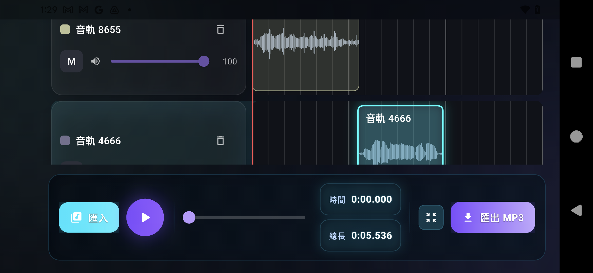

# Clipnote Audio




Clipnote Audio is a Flutter-based multi-track audio editor that uses native FFmpeg decoding and a custom PCM player via FFI. It
supports real-time mixing, spectrum analysis, and waveform editing on multiple tracks.

Clipnote Audio 一個以 Flutter 打造的多軌剪編、即時播放與匯出的輕量音訊編輯器。支援跨軌「兩端相接」磁吸、BPM/毫秒網格、拖曳時跨軌導引線、可視範圍波形繪製與批次混音。

## Features / 功能

特色亮點

跨軌磁吸（Butt-Join）
片段右端 ↔ 另一片段左端相接時自動吸附，並畫出跨所有音軌的青色導引線。支援：

同軌相接

上下不同音軌相接（重點）

播放頭 / 時間網格對齊

導引線（Snap Guide）
命中目標（片段邊、播放頭、網格）即顯示全域導引線；拖離門檻即消失。

動態門檻（像素手感一致）
吸附門檻會依 pxPerMs 等比例換算，縮放後手感不飄。

只畫可視範圍
網格與波形依目前水平捲動範圍繪製，流暢可擴至長時程專案。

互動期快移、釋放再重建
拖曳中只調整目標時間（不混音），放開才重建 touched 軌與 master。

BPM 或固定毫秒網格
setGridByBpm(bpm, division) / setGridMs(stepMs) 一鍵切換。

Alt 一鍵暫停磁吸（桌面）
按住 Alt 即可暫時關閉磁吸，精調位置更方便。

滑動自動追隨 / 邊緣自動卷軸
播放時視窗自動追隨；拖曳靠近左右邊界可自動卷軸。

匯出
內建 WAV，支援 M4A（AAC）；MP3 依裝置 FFmpeg 變體而定。

## Project Structure / 專案結構

```
lib/
  main.dart                // App entry, loads MultiTrackEditor
  modules/
    decoding/              // FFmpeg decoder & PCM player FFI
    editing/               // Track, segment, and editor widgets
    file_access/           // File picker utilities
    merge_mix/             // MixBus for combining tracks
    volume/, effects/      // Effect placeholders
```

## Getting Started / 使用方式

### Prerequisites / 事前準備

- Install the Flutter SDK (3.x or later).
- Build native libraries `libffmpeg` and `libaudioplayer` for your target platform. An Android build script is provided in `build_ffmpeg.sh`.

安裝 Flutter SDK（建議 3.x 以上）；並為目標平台編譯 `libffmpeg` 與 `libaudioplayer` 原生函式庫，可參考 `build_ffmpeg.sh` 的 Android 範例。

### Setup / 設定步驟

1. `flutter pub get`
2. `flutter run`

或在桌面／行動裝置上使用 `flutter run` 啟動應用程式。

### Testing / 測試

Run `flutter test` to execute widget tests.

執行 `flutter test` 以執行元件測試。

## License / 授權

This project is licensed under the BSD 3-Clause License.
See [LICENSE](LICENSE) for the official English text and [LICENSE.zh](LICENSE.zh) for a Chinese translation.

本專案以 BSD 3-Clause 授權，詳見 [LICENSE](LICENSE)（英文）與 [LICENSE.zh](LICENSE.zh)（中文翻譯）。
